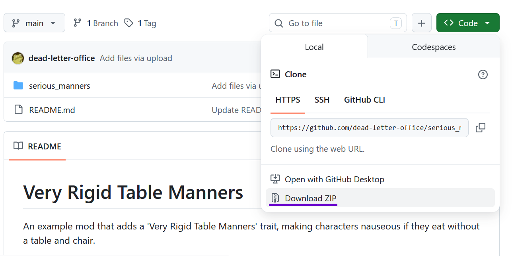
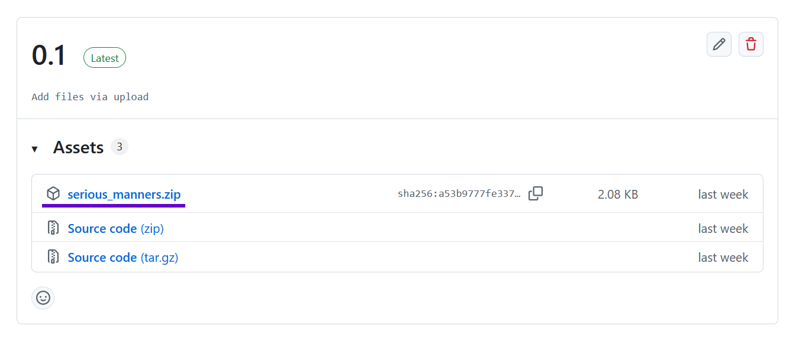
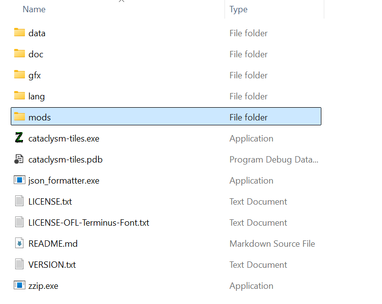
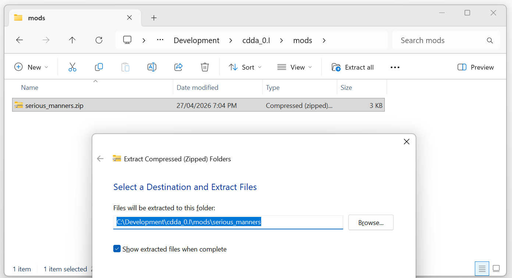
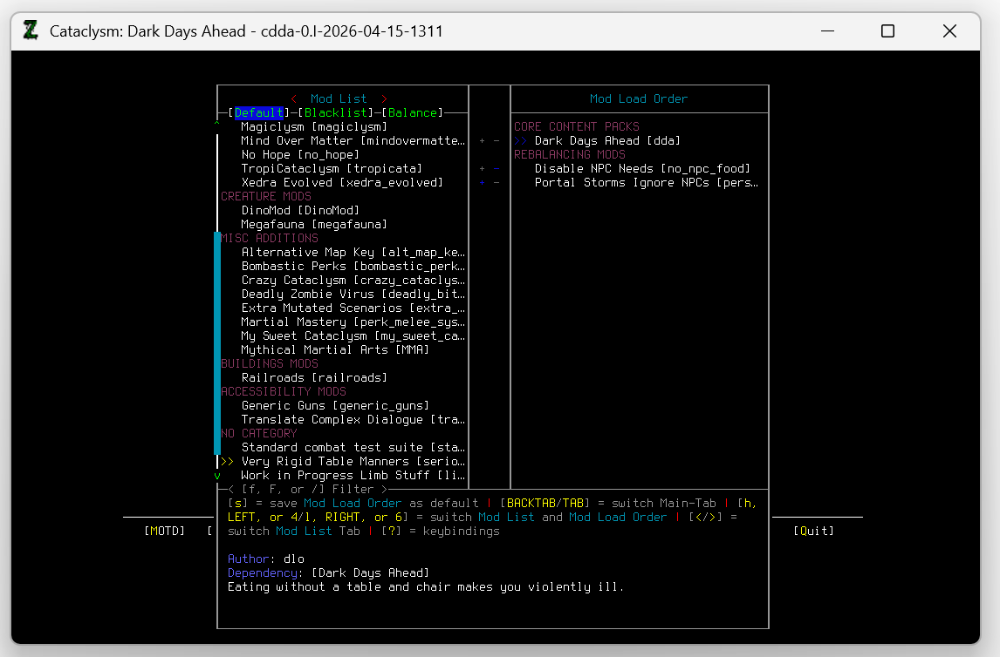

# Installing 3rd Party Mods for Cataclysm: Dark Days Ahead

### 1. Downloading the mod

Many third-party Cataclysm mods are hosted on github. 

These can be downloaded either by clicking `Code -> Download Zip`

<kbd></kbd>

or by finding a file on the mod's `Releases` page

<kbd></kbd>

### 2. Go to the game directory and find the mods folder

<kbd></kbd>

### 3. Unpack the mod into its own folder

<kbd></kbd>

### 4. Check the mod is available when creating a new world

<kbd></kbd>

> **Note:**    
> If you play Cataclysm with a launcher, the process of installing mods might be different for you.    
> Check with the launcher's project for information on manually installing mods.
