# Creating a Simple Mod

This is a walkthrough of creating a simple mod for Cataclysm: Dark Days Ahead.

### Introduction

I like to play characters that have the `Rigid Table Manners` trait. This is a roleplaying trait that encourages players to sit at a table and chair before they eat. It gives the character a small morale debuff if they eat anywhere else.

To me, a small morale penalty doesn't feel very rigid. What if the penalty were worse? 

What if eating anywhere other than a table and chair made the character projectile vomit?

That will be the goal of this mod, which will be called `Very Rigid Table Manners`.

### Acknowledgements

This walkthrough uses screenshots of Cataclysm: Dark Days Ahead, text from its JSON API, and excerpts from its documentation. All of those sources are created and maintained by [CleverRaven](https://github.com/CleverRaven) and [the CDDA contributors](https://github.com/CleverRaven/Cataclysm-DDA/graphs/contributors). The full authorship for the documentation excerpts can be found [here](https://github.com/CleverRaven/Cataclysm-DDA/commits/master/doc/JSON/EFFECT_ON_CONDITION.md). The tiles visible in the screenshots are developed in the [CDDA Tileset repository](https://github.com/I-am-Erk/CDDA-Tilesets) by their [contributors](https://github.com/I-am-Erk/CDDA-Tilesets/graphs/contributors). Finally, the walkthrough also uses screenshots of the [Hitchhiker's Guide to the Cataclysm](https://cdda-guide.nornagon.net), which is developed by nornagon.

### Step 1: The modfile

The first step in making our vomit mod is creating the modfile. This is a simple definition file, written in [JSON](https://www.digitalocean.com/community/tutorials/an-introduction-to-json), which the game uses to recognize and categorize all of the other files in the mod. 

There is an example modfile in [the official modding guide](https://github.com/CleverRaven/Cataclysm-DDA/blob/master/doc/MODDING.md#creating-a-barebones-mod). 

Ours will look like this:

<kbd>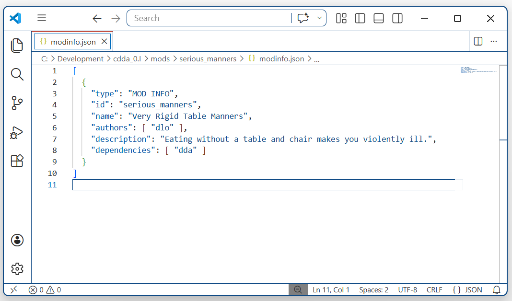</kbd>

We'll put it, along with all our files, in a dedicated folder for the mod under cdda/mods.

<kbd>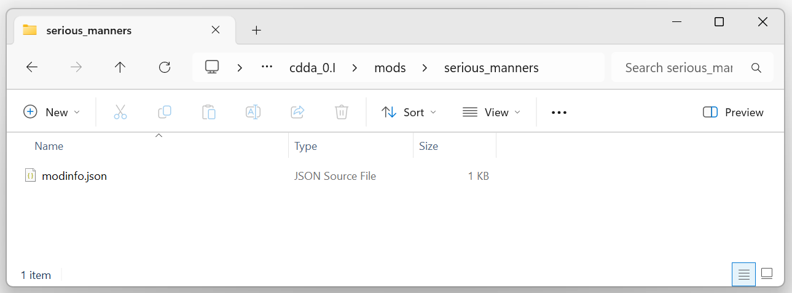</kbd>

As soon as the modinfo is defined, we can create a new world and add it to the world mods list.

<kbd>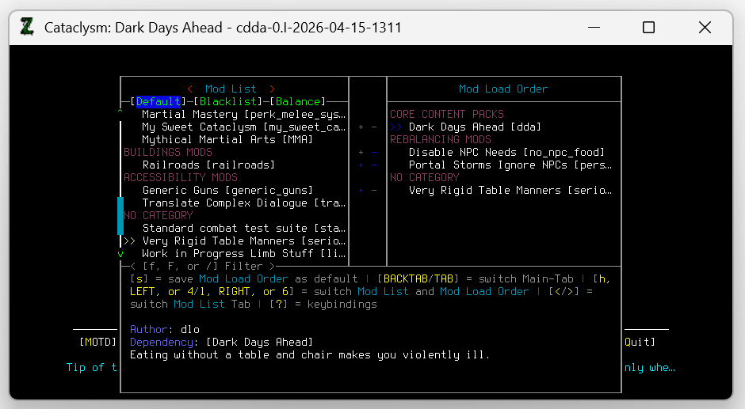</kbd>

There it is. That's the mod. Congratulations. We did it. 

Well, not quite.

> **Note:**    
> An advanced text editor like [Notepad++](https://notepad-plus-plus.org/downloads/) is useful for editing JSON files.    
> The editor used here is Visual Studio Code, which needs some configuration to disable intrusive features.

### Step 2: Now what?

We have the modfile, and this will let us add the mod to games when creating new worlds, but it won't change the game in any way on its own. We will need to add more if we want to make our character throw up.

Since this mod will be a more severe version of Rigid Table Manners, we can start by looking at that trait in the base game for inspiration.

Where is it defined?

Searching for the trait's name in the game folder gives some promising results.

<kbd>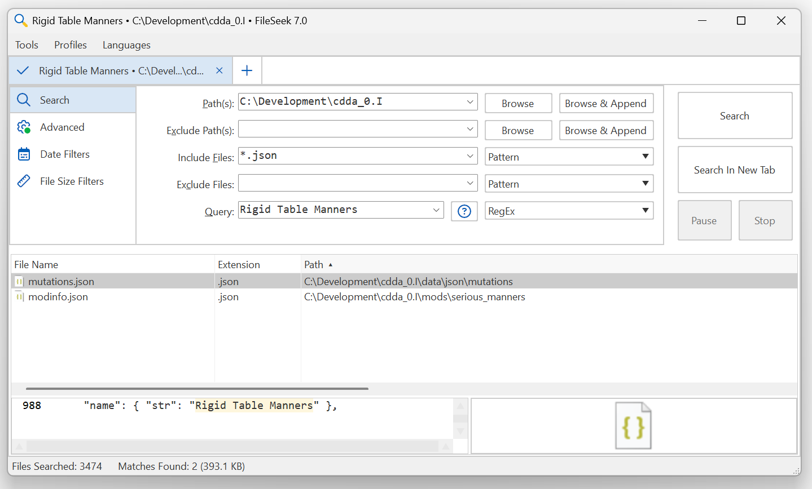</kbd>

Here we can see our own modfile in the results, as well as a `mutations.json`.

Opening the mutations file, we can see that Rigid Table Manners is defined as a `mutation` (a trait).

<kbd>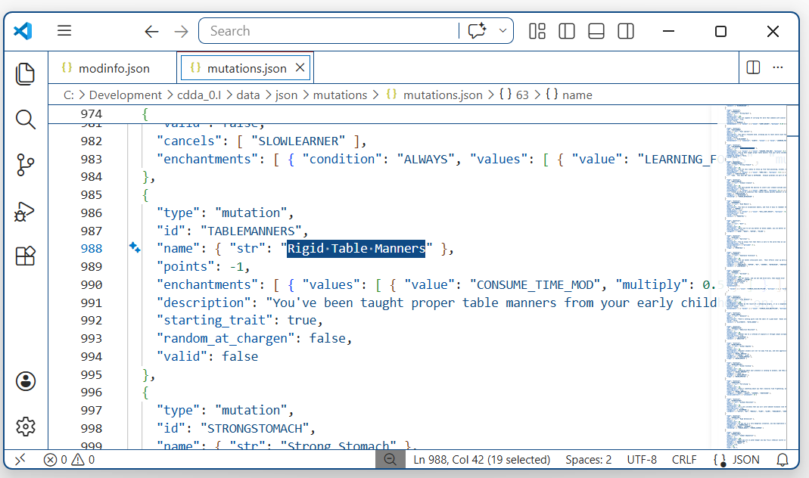</kbd>

This kind of record is explained in the project's [Mutations](https://github.com/CleverRaven/Cataclysm-DDA/blob/master/doc/JSON/MUTATIONS.md) documentation, but the format looks simple enough.

We can use the same structure to define our own mutation.

Our new trait will look like this:

<kbd>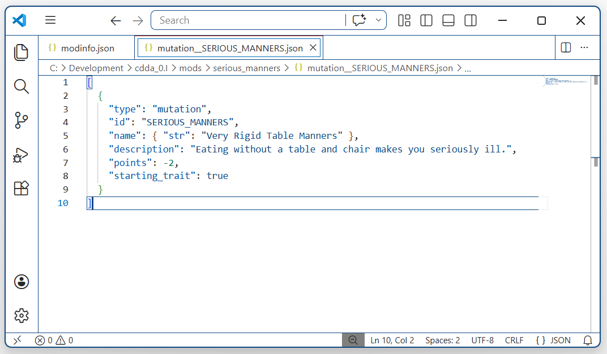</kbd>

This is the hook that everything else will hang off. Characters with the `SERIOUS_MANNERS` trait will experience the new behavior, and characters without it won't. But how do we even start to add that behavior?

> **Note:**    
> A sophisticated search tool like the free version of [Fileseek](https://www.fileseek.ca/Download/) can be very useful for navigating the game's JSON files.

### Step 3: Adding the behavior

Most complex logic in mods is accomplished by using the game's `effect_on_condition` record type. 

Effects on condition are a way to define 'if-then' logic that the game will follow. For example, if the character drinks a mutagen, then make them mutate. If they cast a teleportation spell, then move them to their destination. Much of the game's core and modded behavior uses this powerful system.

Therefore, our next step will be to read the project's 37,000 word [Effect on Condition](https://github.com/CleverRaven/Cataclysm-DDA/blob/master/doc/JSON/EFFECT_ON_CONDITION.md) documentation in its entirety.

...

On second thoughts, let's keep that as a backup option.

We really only care about what the character is eating, so we can search the document for 'eat' and see what comes up.

<kbd>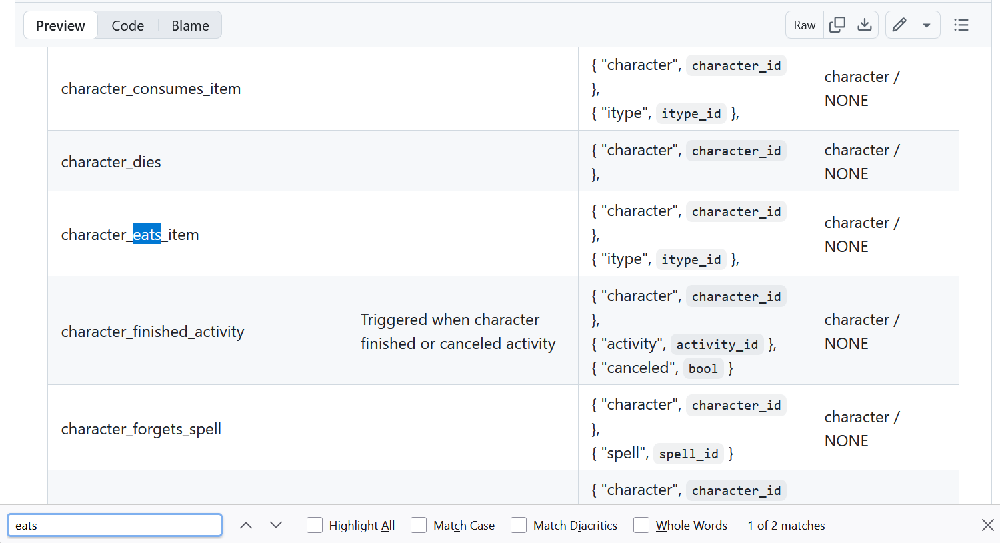</kbd>

This looks promising. `character_eats_item` is described as an event generated when a character eats something.

Further down the page, the document shows us how to create an EOC (effect on condition) that will run when an event happens.

<kbd>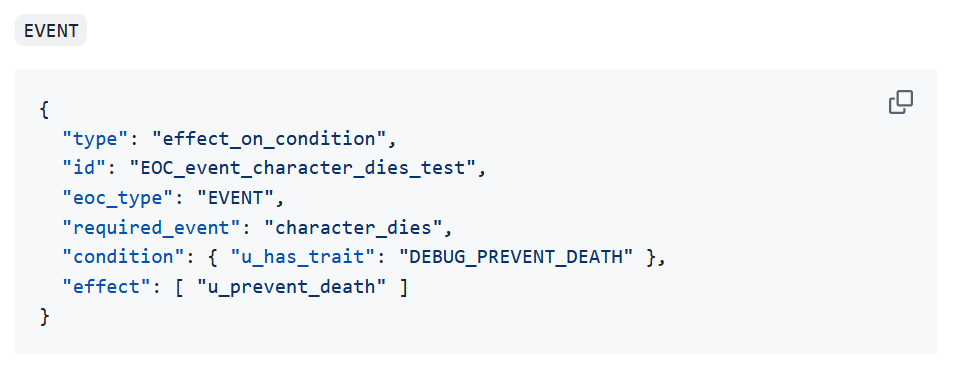</kbd>

By taking our inspiration from that example and substituting in the right event name, we should have the bare bones of the behavior we want.

Let's add a new file for the EOC.

<kbd>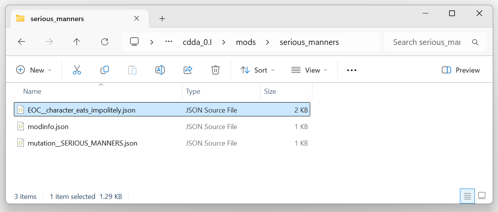</kbd>

and add code to catch the event:

<kbd>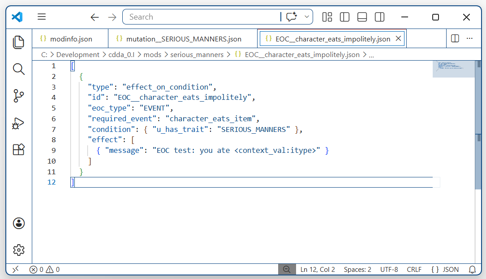</kbd>

There. We've created an effect on condition. It's an `EVENT` type, and the event that triggers it is `character_eats_item`. The EOC documentation has told us how to check for a character trait, and so we've added that check to the EOC as a condition. This logic will only trigger for characters who have our `SERIOUS_MANNERS` trait.

The `effect` property is where we'll put the logic.

For now, let's just leave it writing some text to the game log, so that we can tell everything's working so far.

<kbd>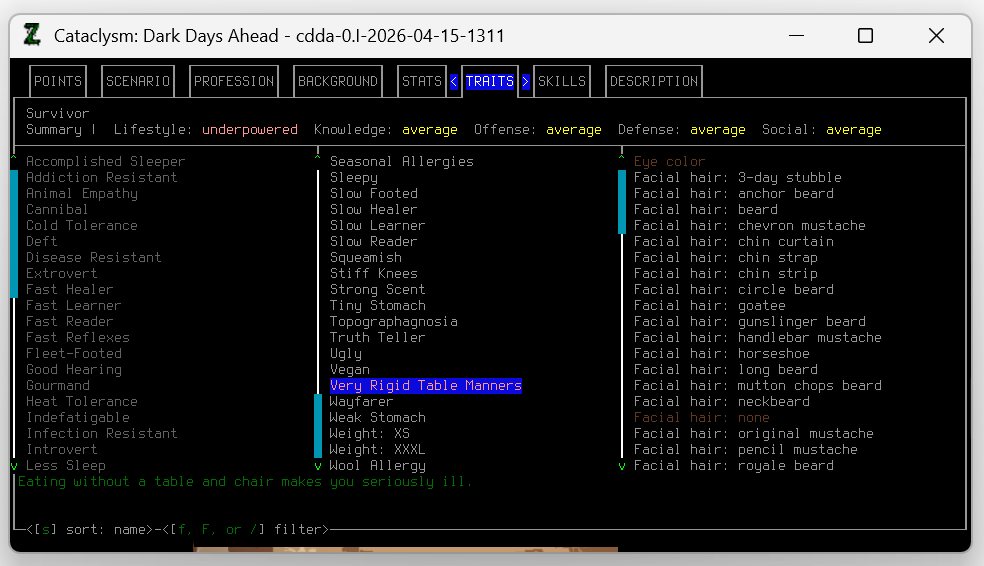</kbd>

<kbd>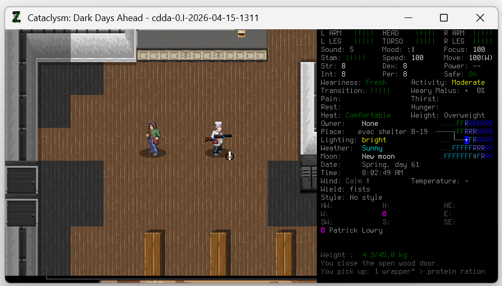</kbd>

Here's our character creation process, selecting `Very Rigid Table Manners` and spawning in the evac shelter. We even have a friend to conduct experiments on later, a random starting NPC named Patrick Lowry.

We should be all set up. Let's eat a variety of objects to see what happens.

<kbd>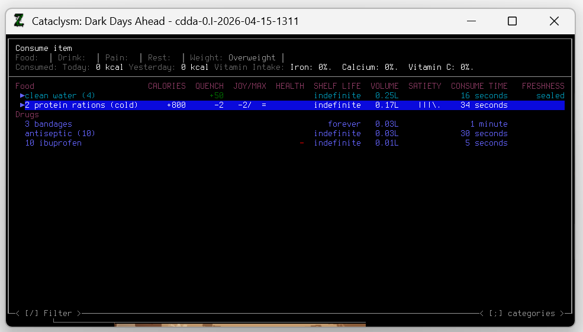</kbd>

<kbd>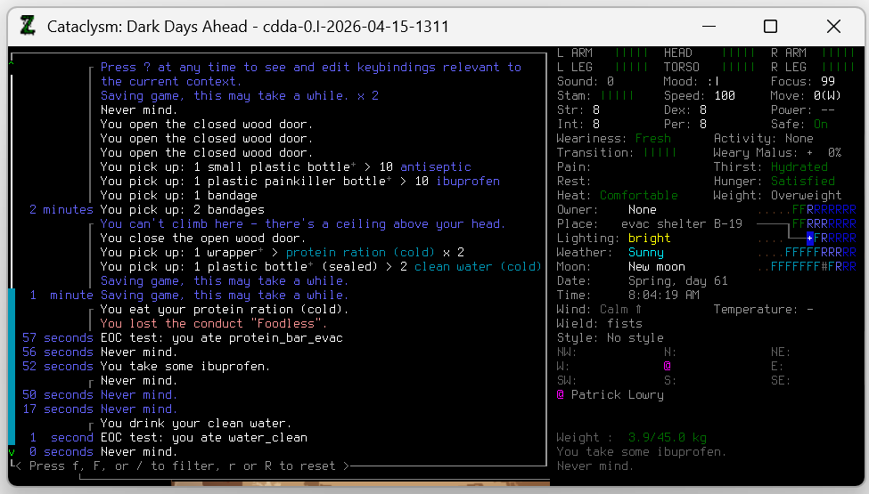</kbd>

We can see that our EOC is working. The message is written to the log after we eat the protein bar and drink the water. We can also see that taking ibuprofen does not trigger the event. We can guess that using bandages and antiseptic won't either. That's good. This trait should only apply to eating (and to drinking, we conveniently just decided).

### Step 4: Checking for a chair

We have an EOC that triggers whenever the character eats something. If we wanted our mod to make the character throw up absolutely everything they ate and drank, we'd almost be done, but our mod needs to be more discriminating.

How can we make our EOC check if the character is sitting on a chair? Or is next to a table? 

At this point we don't know for sure that it is possible, but we have hope, so we go back to the [Effect on Condition](https://github.com/CleverRaven/Cataclysm-DDA/blob/master/doc/JSON/EFFECT_ON_CONDITION.md) documentation.

Tables and chairs are both furniture, so we take a swing in the dark and search for 'furniture'.

Something very promising shows up in the results.

<kbd>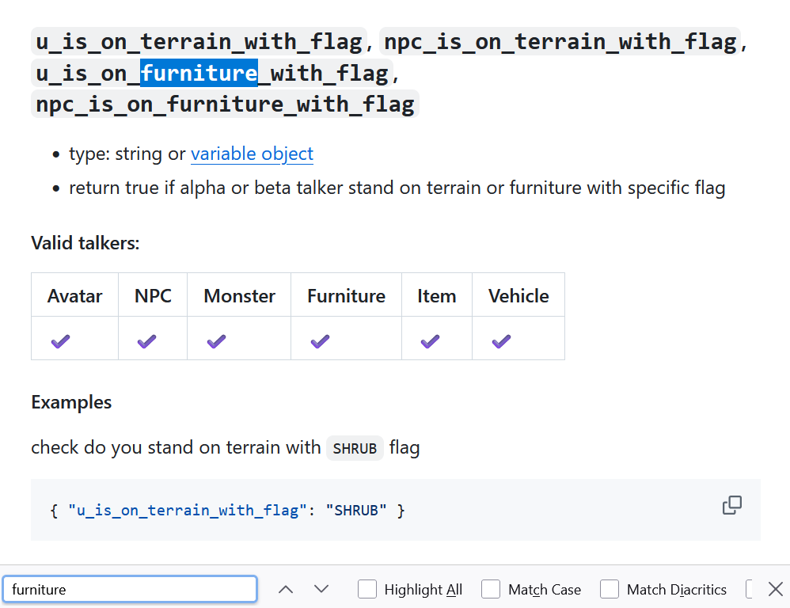</kbd>

The `u_` here refers to the user, or the player character, and a flag is a special tag the game uses to identify furniture, terrain, monsters, and items that share a given characteristic.

If we can find a flag for chairs, then this looks like it will be exactly what we need.

Rather than search in the game files, we can check the [Hitchhiker's Guide](https://cdda-guide.nornagon.net/furniture/f_chair) entry for chairs, and check if it has any useful flags.

<kbd>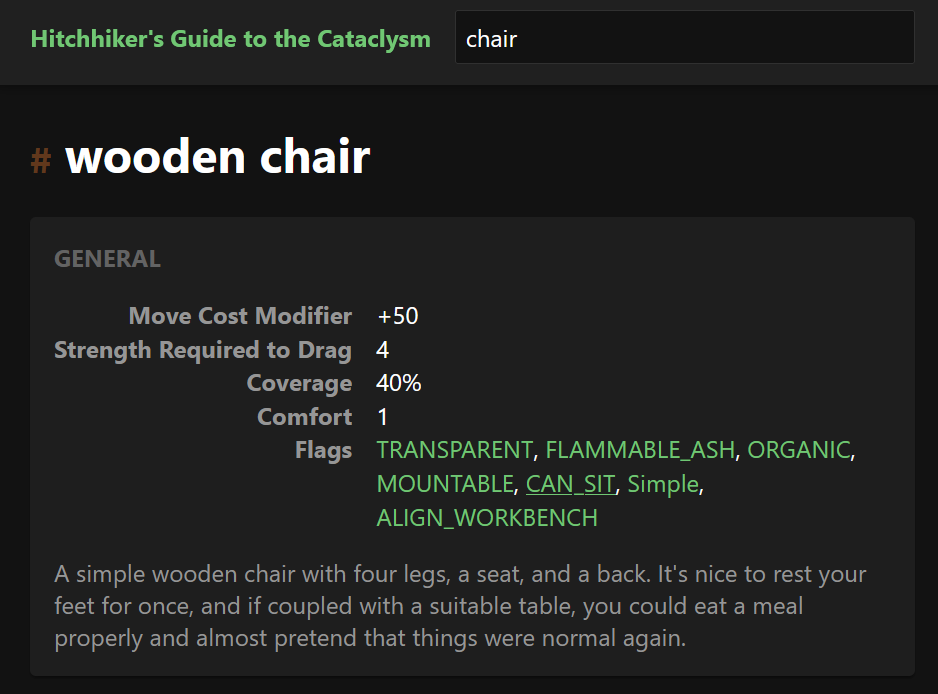</kbd>

`CAN_SIT` looks like a good choice. We should click it to check that it really covers the kind of furniture we want.

<kbd>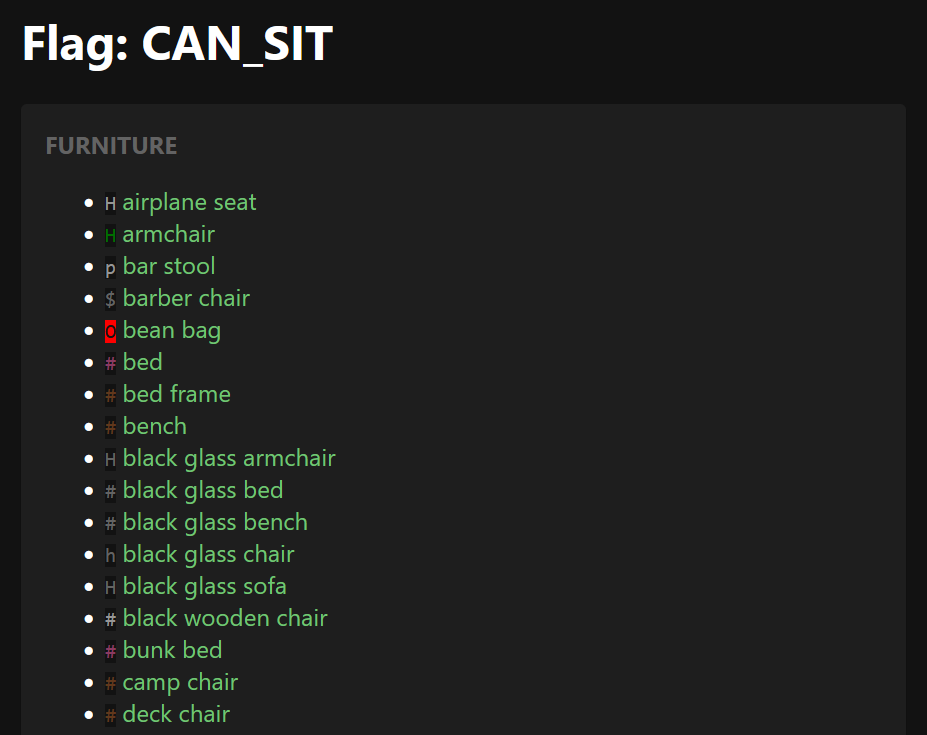</kbd>

This looks like it's exactly what we want. Lets add a check for it in the EOC.

<kbd>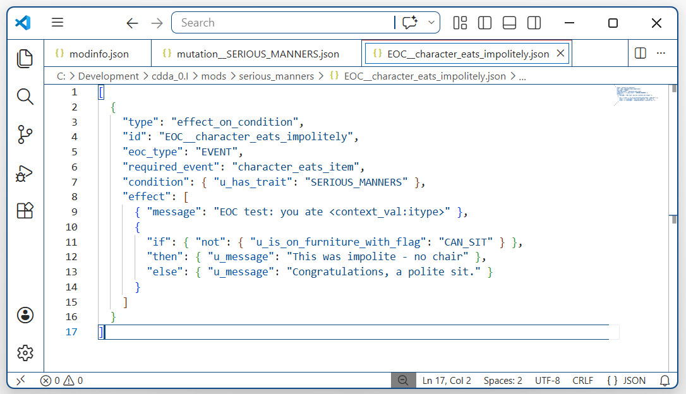</kbd>

That looks right. Now we can test it on our character.

<kbd>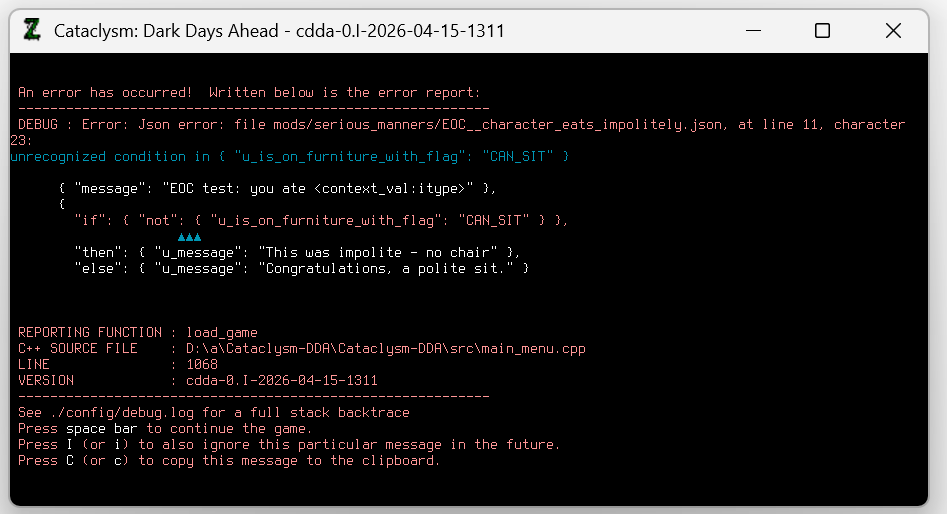</kbd>

As the game loads, we're presented with an error screen.

Here the game is telling us that `u_is_on_furniture_with_flag` doesn't actually exist. It's possible we did something wrong, or it's possible that the documentation is out of date and the function no longer exists. Either way, it's not a big deal. There will probably be another way to accomplish this.

Back to the [Effect on Condition](https://github.com/CleverRaven/Cataclysm-DDA/blob/master/doc/JSON/EFFECT_ON_CONDITION.md) documentation.

Continuing our search for 'furniture', we find this:

<kbd>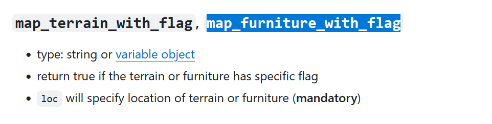</kbd>

It looks similar to the function we were going to use, except that it needs us to give it a location. In another part of the document, we learn we can get the character's current location with a function called `u_location_variable`. With that, we can ask the map if the furniture on that square has our CAN_SIT flag.

<kbd>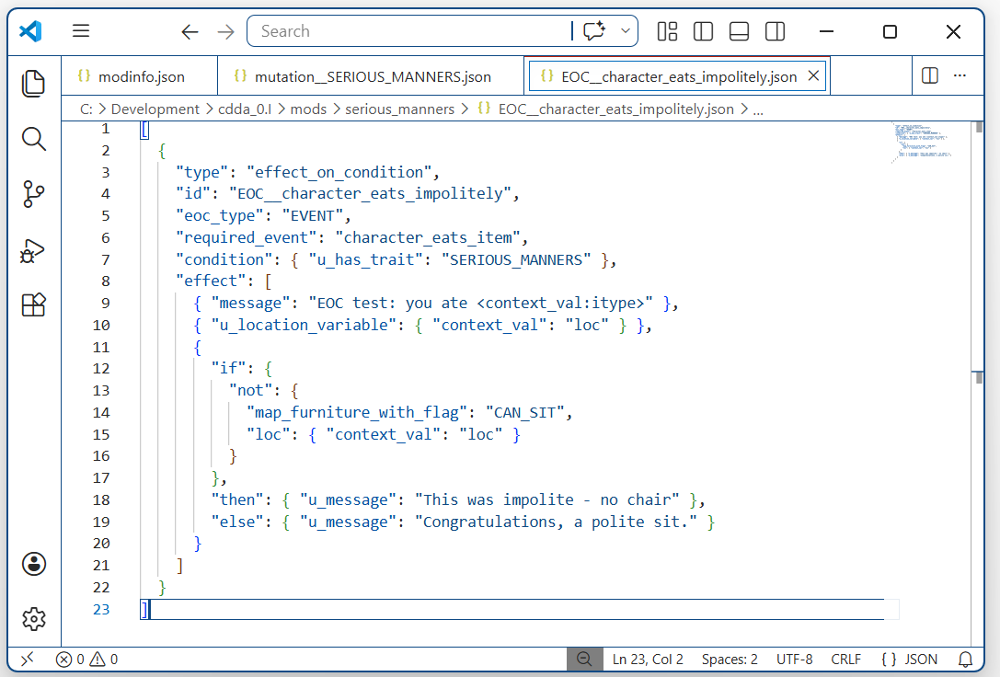</kbd>

Let's try that.

<kbd>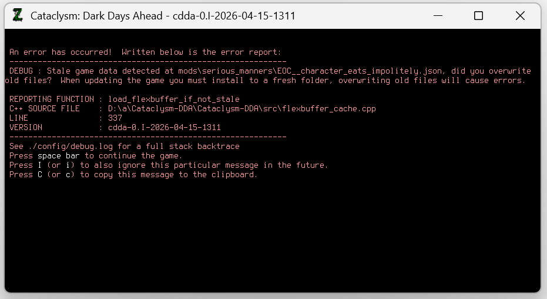</kbd>

We still get an error, but this is just a 'stale game data' error, telling us that the files have changed unexpectedly. We can hit I to ignore it with no negative consequences.

<kbd>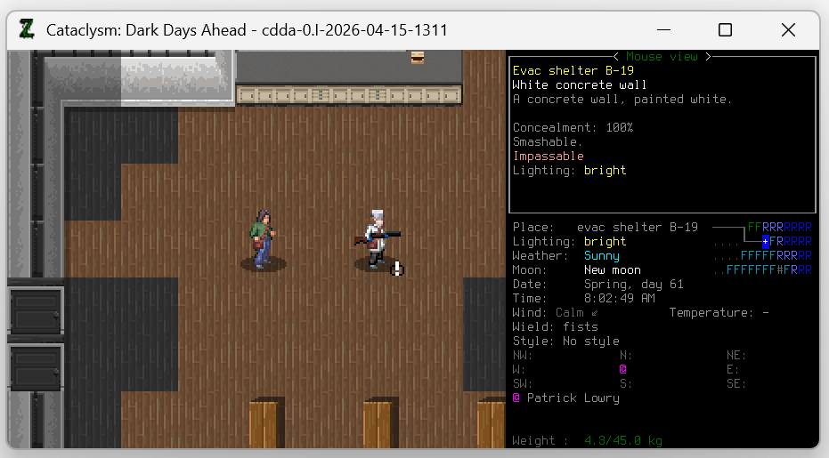</kbd>

The game loads. There's our character, and our NPC friend. But what happens if we eat something?

<kbd>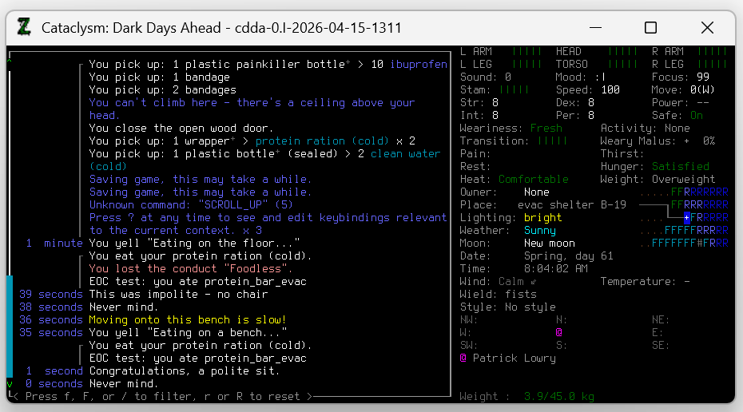</kbd>

It works. We used the chat menu to shout what we were doing to make the log more clear. First we ate a protein ration on the floor and got the message 'This was impolite', then we moved to a bench and ate a second ration. This time we got the message 'Congratulations, a polite sit'. It looks like our chair-detection logic works.

### Step 5: Checking for a table

Now that we can tell if our character is eating while sitting on a chair, we need to check if they're next to a table.

This is probably going to be a bit harder. For the chair, we only had to check one location, the square that the character was on. To check if there's a table nearby, we will have to check every square around the character.

How can we possibly do that? We'll have to go back to the [Effect on Condition](https://github.com/CleverRaven/Cataclysm-DDA/blob/master/doc/JSON/EFFECT_ON_CONDITION.md) document.

We did our chair checking object using the `map_furniture_with_flag` function. Our check for a table will probably also involve the map, so lets search on that.

<kbd>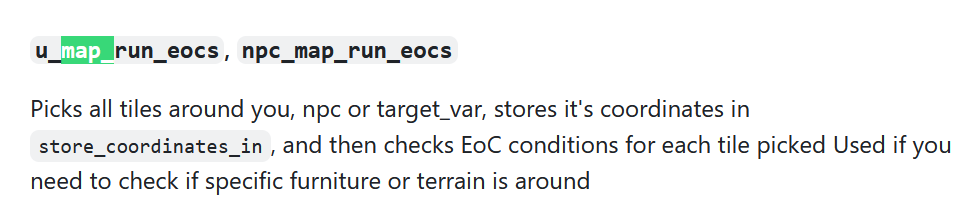</kbd>

<kbd>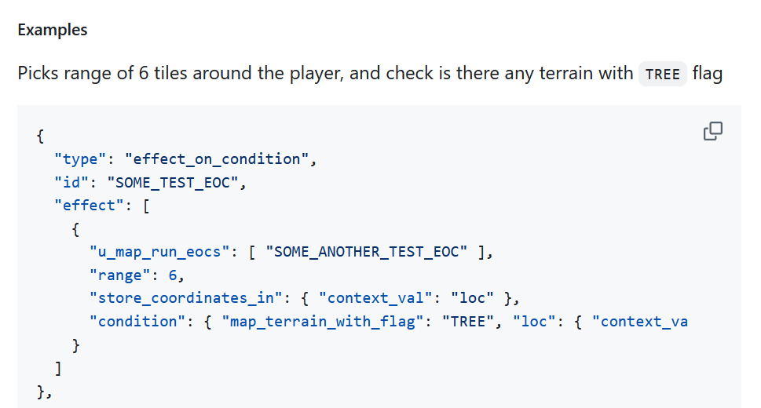</kbd>

Part way down the document we find this. It's a complicated function. It takes an EOC as a parameter, and runs that EOC on every square around the character. This sounds like we might be able to use it to check for tables around the character. 

First we need to find another flag, this time for table-like furniture.

<kbd>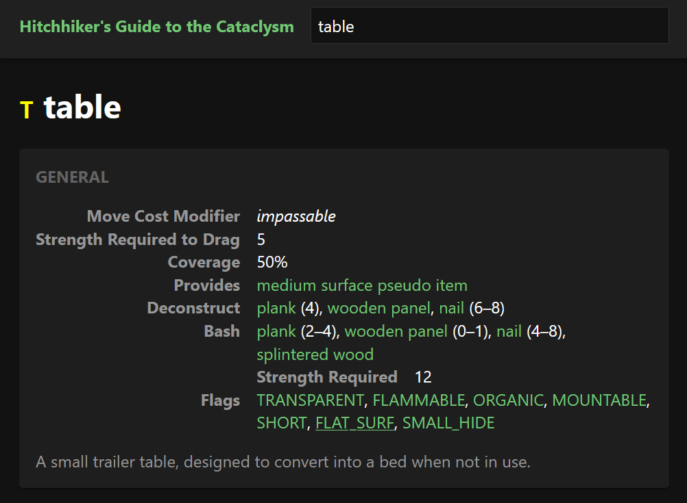</kbd>

Here's the Hitchhiker's Guide record for tables, and there's a promising flag listed: `FLAT_SURF`, for flat surfaces.

<kbd>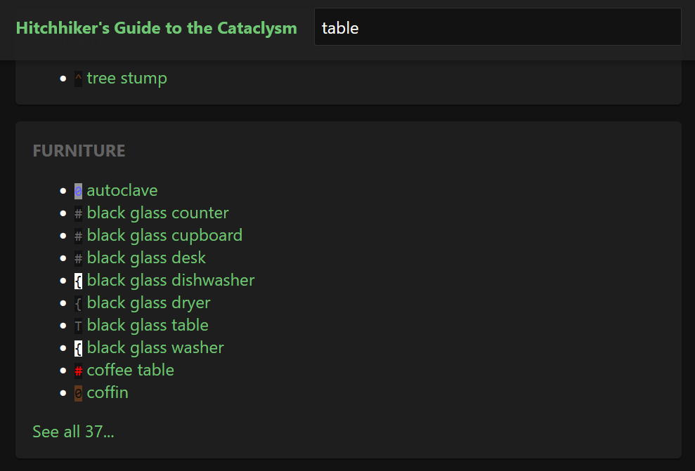</kbd>

Well... It's on tables, counters, and cupboards, which we like. It's also on autoclaves, dishwashers, dryers, and coffins.

Is it really okay for someone with this trait to eat their dinner off a coffin?

Since the alternative is individually checking for every furniture type we find acceptable, we decide that it's probably fine.

Let's plug it into the EOC.

<kbd>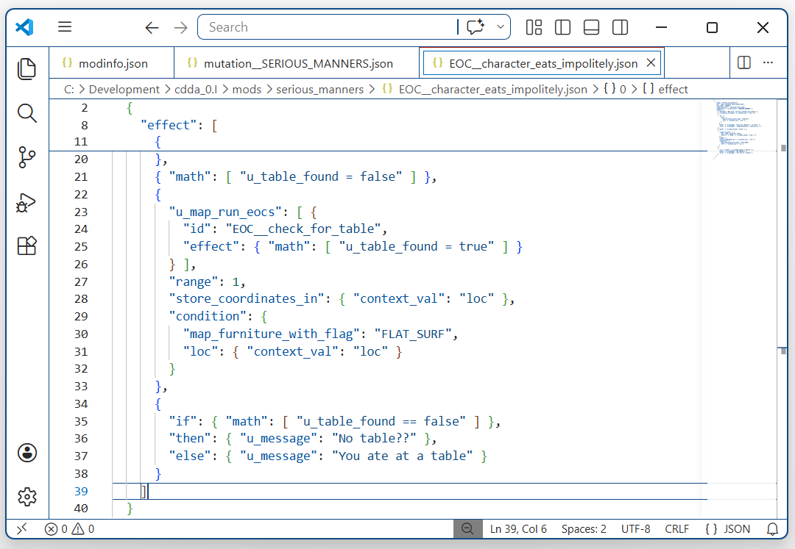</kbd>

Here is our check for tables. `u_map_run_eocs` runs on every square within 1 tile of the character (every adjacent square and the one they're on), the condition checks if that location has a furniture with `FLAT_SURF`, and if it does, it sets the user variable `table_found` to true. The code at the bottom just writes a message depending on whether or not a table was found.

Let's test it.

<kbd>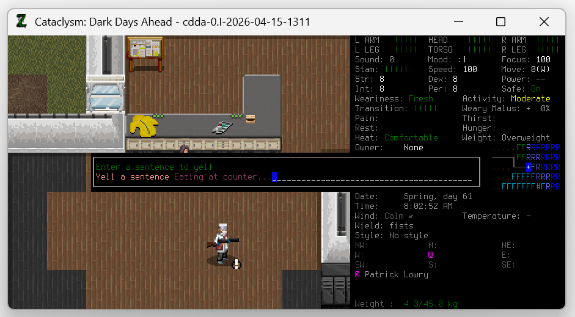</kbd>

<kbd>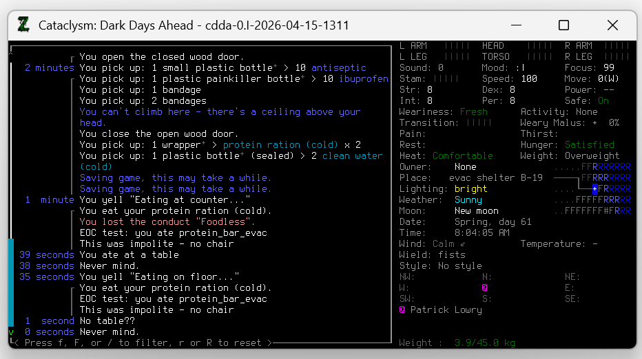</kbd>

It seems to have worked. Eating at a counter wrote the message 'you ate at a table' and eating on the floor wrote 'No table??' exactly as we wanted. We were lucky this time. Often, getting something to work needs a little back-and-forth to identify and correct all the small mistakes.

Now we have a working chair check, and a working table check, and we have both of them running when a character eats food.

We're almost there.

### Step 6: Bringing the parts together

First, we'll clean up our EOC.

<kbd>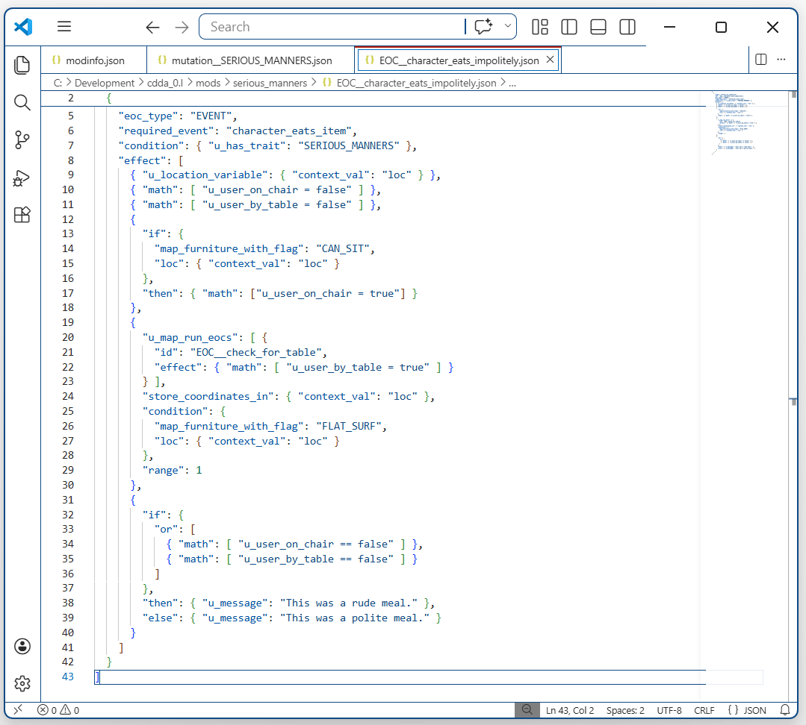</kbd>

At the top we create two user variables, `user_on_chair` and `user_by_table`. We set them both to false to begin with, since we assume the player is not on a chair or at a table until proven otherwise.

Below that, we use `map_furniture_with_flag` to check if the character is on a valid chair. If they are, then we set `user_on_chair` to true.

Next, we run `u_map_run_eocs` to try and find something they can eat off, whether that's a table, a coffin, or even a plastic groundsheet (picnics are permissable under SERIOUS_MANNERS). If we find one, we set `user_by_table` to true.

Finally we check the value of our two variables. If either is false, if we aren't on a chair, or don't have a table, then we write a message saying that this is an invalid place to eat. Later on, this will be where we put our vomit-inducing logic, but this is enough for testing.

So let's test it. We start up the game, load our character, and run four tests:

1. Eating on the floor (no table)
2. Eating on a bench (no table)
3. Eating at a counter (no chair)
4. Eating on a bench with a counter.

We want cases 1-3 to write the message 'This was a rude meal' since they are each missing something vital to the polite dinner experience. We also expect case 4 to succeed, with the message 'This was a polite meal'.

Testing...

<kbd>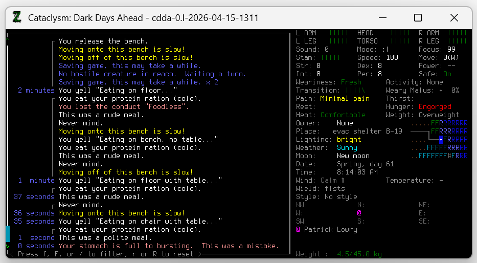</kbd>

It seems to have worked. Eating or drinking anything without a table and chair is classified as an invalid location to eat by this logic.

All that's left is to add the nausea effect.

### Step 7: Throwing up

We need to find out how to make the character throw up. 

We know this is possible, because lots of things in the game already do that, for example if we drink too much alcohol, or drink unclean water. 

We can look for an example in the game data.

<kbd>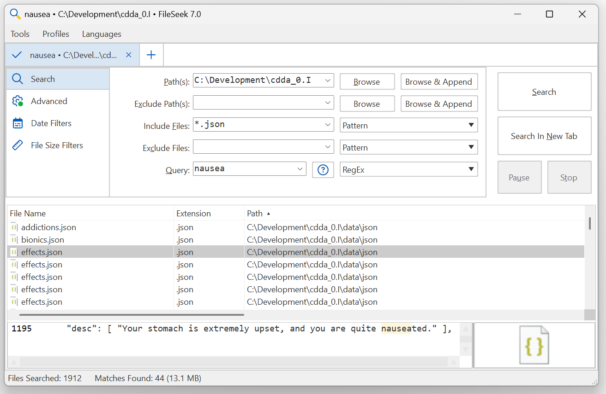</kbd>

Nausea. Exactly what we need.

Opening `effects.json`, we find the definition for food poisoning, and listed in its `base_mods` we find what we want: `vomit_chance`.

<kbd>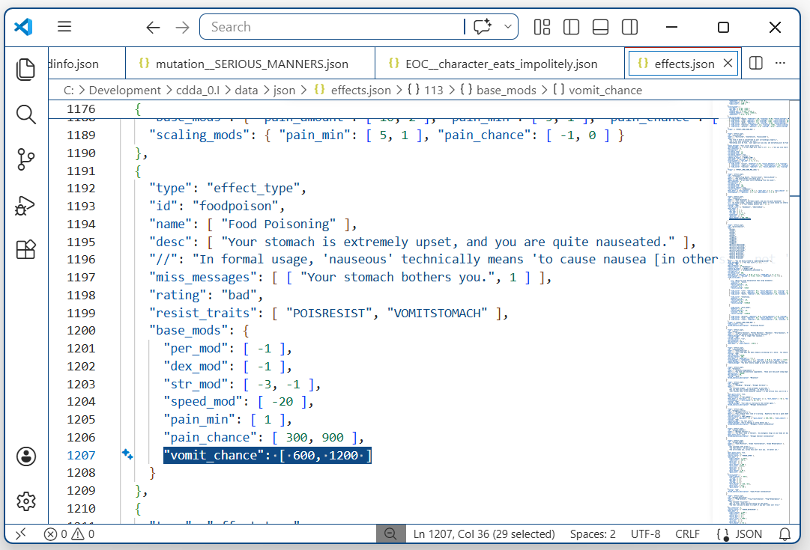</kbd>

The project's [Effects](https://github.com/CleverRaven/Cataclysm-DDA/blob/master/doc/JSON/EFFECTS_JSON.md) documentation tells us that this number is the denominator in a 1/x dice roll, which will be run every second by default.

This is all we need to create our own nauseating effect.

<kbd>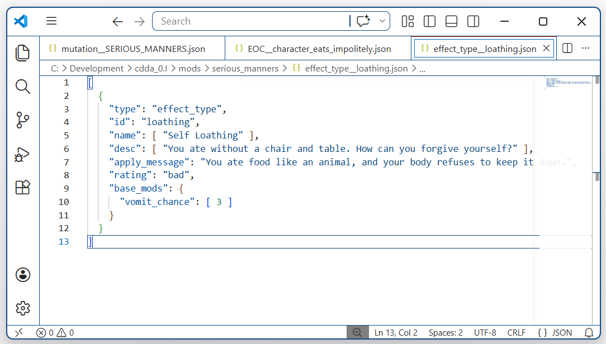</kbd>

Anyone who has this effect will be forced to throw up every three seconds, on average, for as long as it goes on (or until their stomach is empty, which will happen almost immediately).

We just need to give the effect to the player at the right time and we should be done.

<kbd>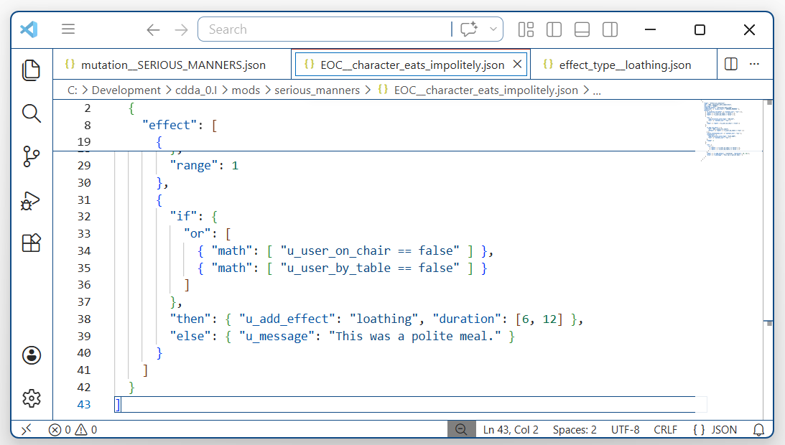</kbd>

and testing it...

<kbd>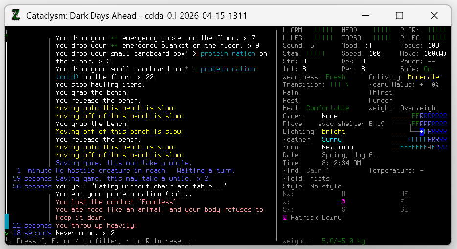</kbd>

<kbd>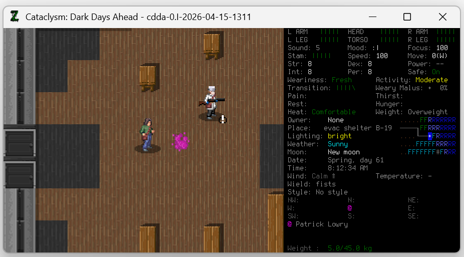</kbd>

<kbd>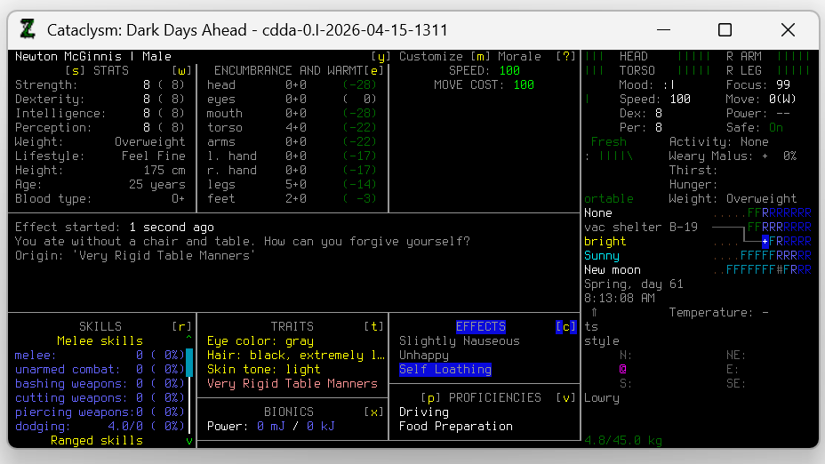</kbd>

We ate without a table and chair, and immediately threw up. There's our new effect, and there's our vomit.

Everything seems to be working perfectly.

### Step 8: The problem

Let's just take a look at our friend, Patrick Lowry. She's perceptive, a vegetarian, and... oh no. 

<kbd>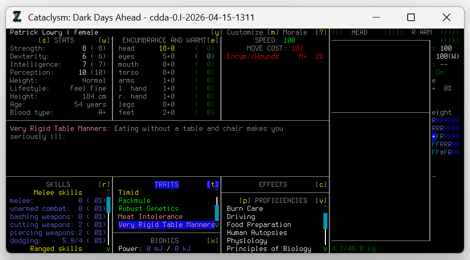</kbd>

She also has `Very Rigid Table Manners`, but being an NPC, she doesn't know how to eat at a table.

What happens if we enable NPC needs and give her some protein rations?

<kbd>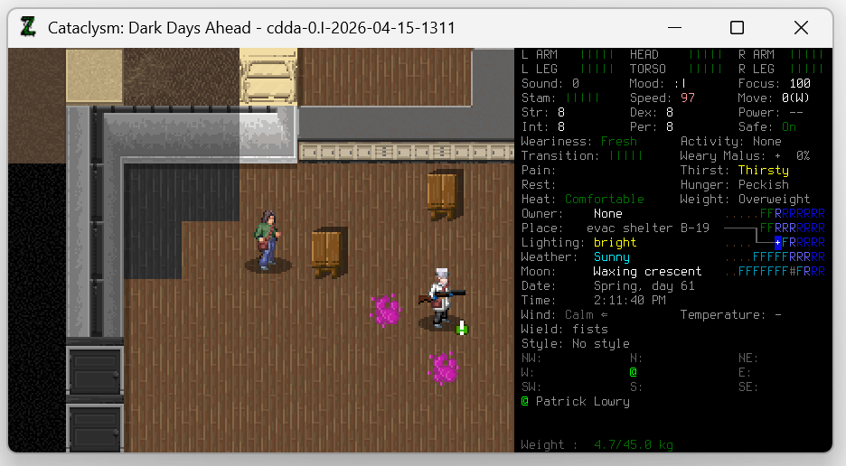</kbd>

This isn't ideal. If NPC needs are disabled, everything will be fine, but if they're enabled, any NPC who spawns with this trait will starve to death, just because they don't know they need to sit down for their meal. Also, I don't want to see the state of the refugee center after a few days of that. 

We could probably stop the trait from appearing on random NPCs, but there would still be the issue of the player taking control of other characters, at which point their old body would become an NPC. Also, what if the player has to take control of an NPC with the SERIOUS_MANNERS trait? That would be an interesting complication.

Let's just put a check to make sure this logic only happens for the player character. `u_is_avatar` in `condition` will disable this check for any character who is not currently the player avatar.

<kbd>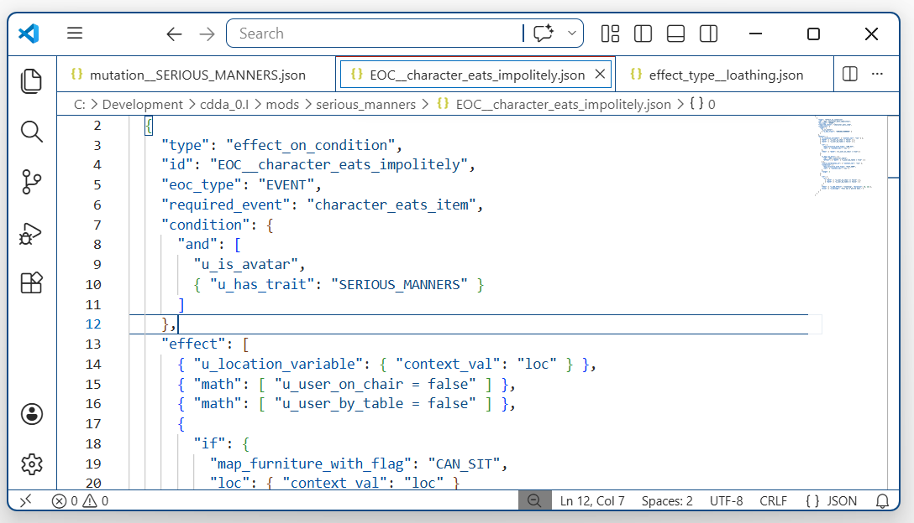</kbd>

Finally, we should test to see if our friend still has problems eating.

<kbd>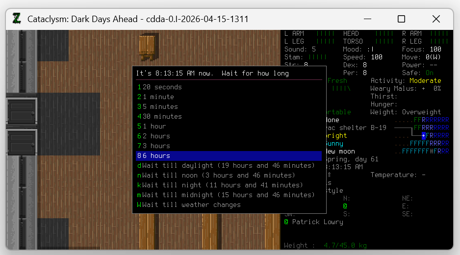</kbd>

<kbd>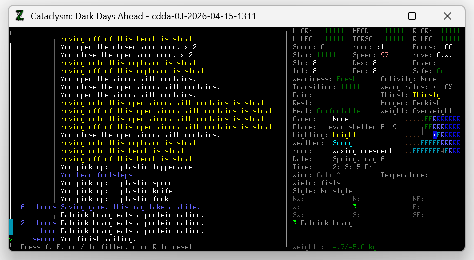</kbd>

That's it. This simple mod is finished.

There is still room for improvement. Maybe `SERIOUS_MANNERS` should exclude drinks, or ignore coffins. Maybe actually eating at a table should provide a mood boost, to make up for the inconvenience. Maybe a plate, knife, and fork should be required, and maybe eating without them should make the character's head literally explode. All options are possible. For now, projectile vomit is enough.

### Conclusion

This was a short walkthrough of creating a simple mod. The whole process might take less than an hour, using well-documented functions. Many mods would be no harder to make than this, whether they're adding an item, a new monster, creating a spell, or tweaking some existing behavior to the modder's liking, and the skills used for modding can also transfer to contributing to the game. 

Deeper in, with more complex behavior, modding becomes harder. There aren't always rote answers or examples to follow. At those times workarounds, strange hacks, and a willingness to compromise are important. 

### A Warning Against AI

Finally, a warning against using AI when working on CDDA mods. 

AI coding assistants promise the world in terms of their capabilities, but very often fail to deliver. The code they generate is famous for having subtle errors that take intense scrutiny in order to spot and correct. In the field of CDDA modding, this means they're likely to turn a simple JSON coding task into a complex debugging task, eating up any time savings they seem to offer. For this reason, I can't recommend using generative AI or LLM assistants for CDDA modding.

### Further Reading

The CataclysmDDA project has resources on modding, including the [Official Modding Guide](https://github.com/CleverRaven/Cataclysm-DDA/blob/master/doc/MODDING.md).

### Postscript

If you find any errors in this walkthrough, please assume they were deliberately left as exercises for the reader.
